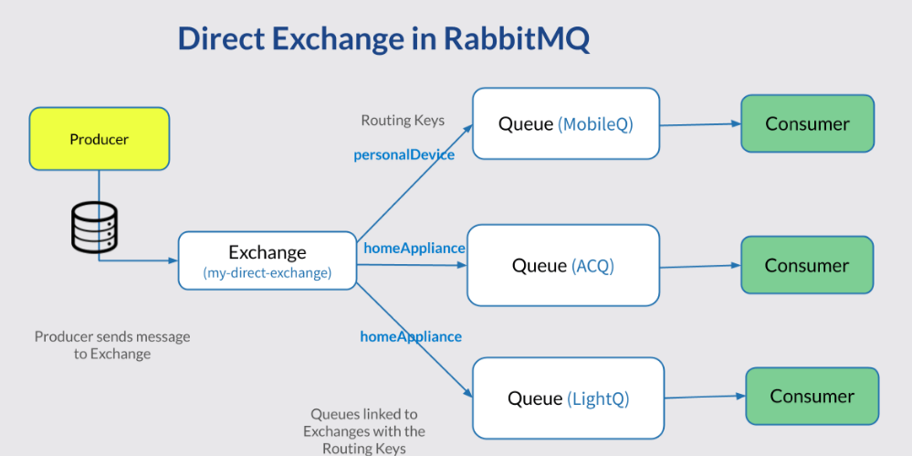
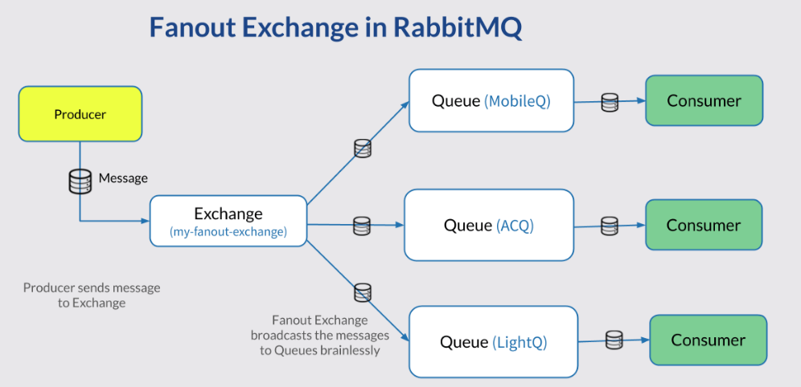
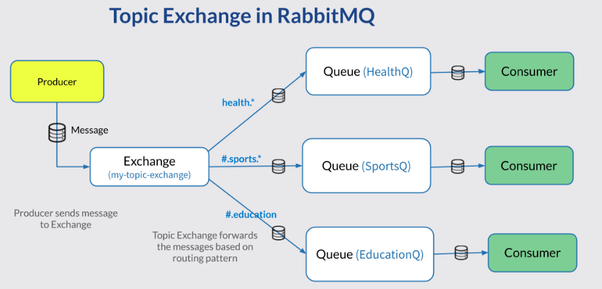
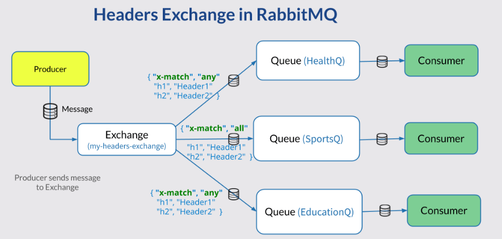

# Queues in AMQP – RabbitMQ
- Queues in AMQ behaves like queues in other messaging systems or task queuing system.
- Queues store messages in FIFO (First-In-First-Out) way.
- Message Queue has properties like
    - Name – Defines the name of the Queue.
    - Durability – If set as Durable, message queue can not afford to lose any message.
    - Exclusive – If set, the Queue is deleted as soon as the connection is closed.
    - Auto-delete – If set as true, the Queue is deleted once the last Consumer has unsubscribed.

# Direct Exchange

#### The flow of a message in Direct Exchange
- A Producer sends a message to an Exchange.
- A Queue binds to an Exchange using a routing key.
- Usually, there is more than one Queue bind to an Exchange using the same/different routing keys.
- The message sent to the Exchange contains a routing key. Based on the routing key the message is forwarded to one or more Queues.
- Consumers subscribe to the Queue receives the message and processes it.

# Fanout Exchange

### The flow of a message in Fanout Exchange
- One or more Queues bind to the Fanout exchange with no routing keys.
- A publisher sends the Exchange a message.
- The Exchange then forwards the message to the Queues unconditionally.

# Topic Exchange

### Routing patterns in Topic Exchange (for example: health.*, #.sports. *, #.education)
- A routing key in Topic Exchange must consist of Zero or more words delimited by dots e.g. health.education.
- A routing key in topic exchange is often called as a routing pattern.
- A routing pattern is like a regular expression with only `*`, . and `#` allowed.
- The symbol star (*) means exactly one word allowed.
- Similarly, the symbol hash (#) means zero or more number of words allowed.
- The symbol dot (.) means – word delimiter. Multiple key terms are separated by the dot delimiter.
- If a routing pattern is `health.*`, it means any message sent with the routing key health as the first word will reach the queue. For example, `health.education` will reach this Queue, but `sports.health` will not work.
### The flow of a message in Topic Exchange
- A message Queue binds to an Exchange with a routing key pattern (P).
- A publisher sends a message with a routing key (K) to the Topic Exchange.
- The message is passed to the Queue if P matches with K. The routing key matching is decided as discussed below.
- The consumer subscribing the Queue receives the message.
### Routing pattern matching examples
- **Routing Key Pattern** – It is the routing key pattern that binds a specific Queue with an Exchange.
- **Valid Routing Key** – The message with this key reaches the linked Queue.
- **Invalid Routing Key** – The message with this key does not reach the Queue.
- 

|Routing Key Pattern    	      |Valid Routing Key      	  |Invalid Routing Key          |
| ------------------------------- | ------------------------- | --------------------------- |
|health.* – `health` as the first word followed by one word. |health.education, health.sports, health.anything |health, health.education.anything, health.education.sports |
|#.sports.* – Zero or more words, then `sports`, after that exactly one word. |sports.education, sports.sports.sports, sports.sports |sports, education.sports, anything.sports.anything.xyz |
|#.education – Zero or more words followed by the word `education`. |	health.education, education.education, education | education.health, anything.education.anything|

# Headers Exchange

### The flow of a message in Headers Exchange
- One or more Queues bind (linked) to a Headers Exchange using header properties( H ).
- A Producer sends a message to this Exchange with a Header property (MH).
- If MH matches with H, the message is forwarded to the Queue.
- The consumers listening to the Queue receives the message and processes it.
### The Headers matching algorithm
- There are 2 types of headers matching allowed which are any (similar to logical OR) or all (similar to logical AND).
- They are represented in the bindings as { "x-match", "any" ..} or { “x-match”, “all” ..}.
- The x-match = any means, a message sent to the Exchange should contain at least one of the headers that Queue is linked with, then the message will be routed to the Queue.
- On the other hand, if a queue is bound with headers has x-match = all, messages that have all of its listed headers will be forwarded to the Queue.
- You can see in the above diagram if a message with header {"h1": "Header1"} is sent to my-header-exchange, it will be routed to both HealthQ and EducationQ.
- Only when the message has both the h1 and h2 headers with correct values, it will be forwarded to SportsQ, HealthQ and EducationQ as well.

# Default Exchange
**Default Exchange** in RabbitMQ is not a special type of Exchange in RabbitMQ like Direct Exchange or Topic Exchange. It is a special Direct Exchange with an empty name. If you have sent a message directly to a Queue using the empty Exchange name. This is where Default Exchange comes to play.
